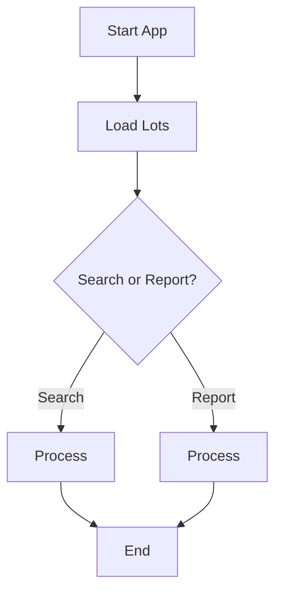

# AOI APP
Built-in desktop application with GUI to search for lots files in different server directories. 

# Getting Started

# Contribute 
## Run Virtual Environment
### Create virtual environment
`python3 -m venv env`
### Activate on MacOS
`source env/bin/activate`
### Windows
`.\env\Scripts\activatepython3 -m venv env`
### To turn off
`deactivate`

## Flow Diagram
